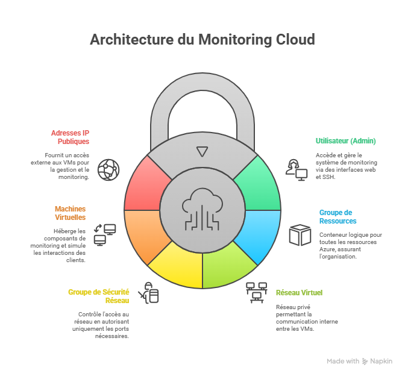

# Projet de Supervision Azure avec Terraform et la Stack TIG

Ce projet met en place une infrastructure de supervision complète sur Microsoft Azure. Le déploiement est automatisé avec **Terraform** et l'architecture est basée sur la stack **TIG** (**Telegraf + InfluxDB + Grafana**).

## Objectifs

- Déployer automatiquement une infrastructure cloud sur Azure via Terraform.
- Mettre en place un système de supervision de ressources (CPU, RAM, disque, etc.).
- Visualiser les métriques en temps réel dans un tableau de bord Grafana.
- Fournir une solution de monitoring simple et évolutive pour un environnement cloud.

## Architecture

Le projet déploie deux machines virtuelles sur Azure dans un réseau privé :

-   **`vm-web`** : Simule une application ou un service à surveiller.
-   **`vm-monitoring`** : Héberge la stack de supervision TIG.

Chaque machine dispose d'une adresse IP publique pour l'accès distant (SSH, interface web de Grafana). Un groupe de sécurité réseau (NSG) filtre les flux pour n'autoriser que les ports nécessaires.



### Composants

| Composant | Description |
| :--- | :--- |
| **Terraform** | Outil d'Infrastructure-as-Code pour créer les ressources Azure (RG, VNet, NSG, VMs, IPs). |
| **Telegraf** | Agent collecteur de métriques système (CPU, RAM, disque, réseau...). |
| **InfluxDB** | Base de données optimisée pour les séries temporelles pour stocker les métriques. |
| **Grafana** | Interface graphique pour visualiser les données avec des dashboards dynamiques. |


## Guide de Déploiement

1.  **Cloner le dépôt** et naviguer dans le bon répertoire :
    ```bash
    git clone [https://github.com/salah99711/infra-azure-monitoring.git](https://github.com/salah99711/infra-azure-monitoring.git)
    cd infra-azure-monitoring/terraform
    ```

2.  **Prérequis** : Configurer votre clé SSH publique dans le fichier `vm.tf`. C'est indispensable pour vous connecter aux machines virtuelles.

3.  **Initialiser Terraform** :
    ```bash
    terraform init
    ```

4.  **Vérifier le plan de déploiement** (recommandé) :
    ```bash
    terraform plan
    ```

5.  **Appliquer le déploiement** pour créer les ressources sur Azure :
    ```bash
    terraform apply
    ```
    > Tapez `yes` lorsque la confirmation vous est demandée.

6.  **Se connecter à la VM de monitoring** en utilisant l'IP publique fournie en sortie par Terraform :
    ```bash
    ssh azureuser@<IP_PUBLIC_VM_MONITORING>
    ```

7.  **Installer la stack TIG** sur la `vm-monitoring` (installation des paquets `influxdb`, `telegraf`, `grafana` et configuration).

8.  **Lancer les services** et les activer au démarrage :
    ```bash
    sudo systemctl enable --now influxdb
    sudo systemctl enable --now telegraf
    sudo systemctl enable --now grafana-server
    ```

9.  **Configurer Grafana** via votre navigateur :
    - **Accès** : `http://<IP_PUBLIC_VM_MONITORING>:3000`
    - **Source de données** : Ajoutez InfluxDB.
    - **Dashboards** : Créez vos tableaux de bord.

## Exemples de Dashboards

Vous pouvez créer des panneaux pour superviser divers indicateurs clés :

-   **CPU** : `usage_system`, `usage_user`, `usage_idle`
-   **RAM** : `used_percent`
-   **Disque** : `used_percent` par partition (`/`, `/mnt`, etc.)
-   **Système** : Uptime, nombre de processus
-   **Réseau** : `bytes_sent`, `bytes_recv`

## Compétences

-   **Cloud** : Azure (VM, VNet, NSG, IP Publique)
-   **IaC** : Terraform (déploiement automatisé)
-   **Monitoring** : Stack TIG (Telegraf, InfluxDB, Grafana)
-   **Visualisation** : Grafana
-   **Système** : Linux (configuration, services `systemd`)
-   **Versionning** : Git & GitHub
